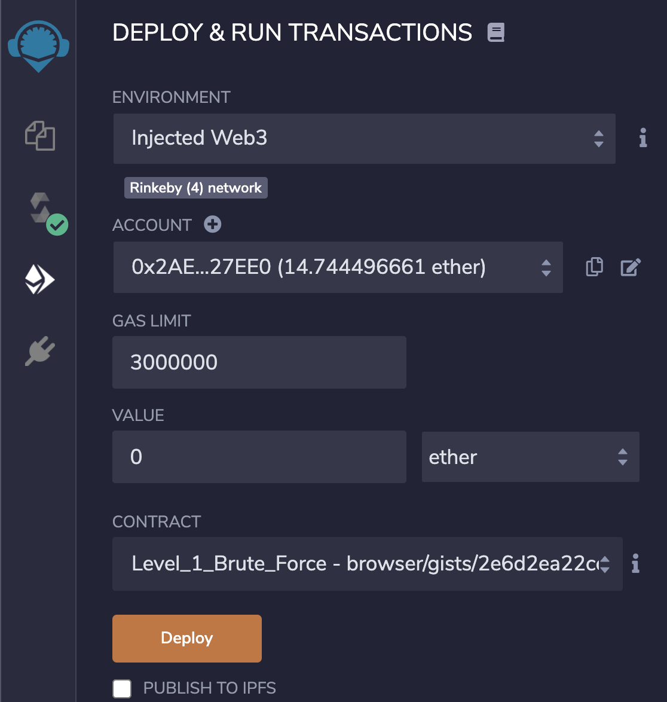

# Homework 11 details

On this platform, Ethereum security professionals and enthusiasts can sharpen their Solidity programming and code review skills by exploiting broken smart contracts. Each level corresponds to a smart contract hacking challenge inspired by real world exploits.

What separates this CTF from the rest is that it is powered entirely by a smart contract developed by Extropy.io. The leaderboard on this website is updated entirely by the players in a decentralized manner as they submit their solutions to the CTF's smart contract.

### What you will need
1. Metamask browser extension
2. Rinkeby testnet ether
3. Remix online IDE
4. Frontend web3 interface via the Extropy CTF website


### Getting set up

If you don't have it already, install the MetaMask browser extension. Set up the extension's wallet and use the network selector to point to the `Rinkeby` test network.

In order to interact with the Rinkeby network, players need to get some testnet Ether from the Rinkeby faucet. Follow the instructions on the website and then check if you have received Ether using Metamask.


Metamask connected to the Rinkeby network

Next, you will need the Remix online IDE in order to hack the levels.

### Deploying a smart contract with Remix

To get started, open all of the levels directly in Remix. This will create and save in Remix a new folder containing the code files for all of the levels, as shown in the image below.


When playing a level, users need to deploy the level they have chosen to play by selecting it from the ones available. This tutorial will use as an example level 1, called `Level_1_Brute_Force.sol`, solutions to new levels will be released weekly by Extropy. Once selected level 1, move to the "DEPLOY & RUN TRANSACTIONS" tab as shown in the image below.



Make sure that the deployment tab shows a connection to the Rinkeby network and that you have selected the right contract, then click on the 'deploy' button, accept the transaction that pops-up on Metamask and wait a few seconds for the confirmation. Once the transaction has been mined, you should see your contract appear at the bottom of the deployment tab, as shown in the next image.


### Interact with the main CTF smart contract

As mentioned earlier, there is a central CTF smart contract powering a leaderboard and managin all players' details; for interacting with this contract you can use the forms and buttons provided in each level's page, which we will go through now.


Step one is to copy the deployed level's address from Remix as shown in the image below.


Then paste the copied address into the appropriate form and also fill in the level number, 1, in this case. Finally click on the "register level" button, which will save the deployed level's address to the main CTF smart contract.

Registering a level is a required step for ensuring that users are not trying to cheat by changing the contracts' code prior deployment; the main CTF contract will let users register a level only if its "opcode" matches exactly the original one.

Congratulations, now let the hacking begin.

### Hacking smart contracts

Let's look at the code for the first level.

  ```Solidity 
  contract Level_1_Brute_Force {

      bool public levelComplete;
      bytes32 public answer;

      constructor() public {
          levelComplete = false;
          answer = 0x04994f67dc55b09e814ab7ffc8df3686b4afb2bb53e60eae97ef043fe03fb829;
      }

      function completeLevel(uint8 n) public {
          bytes32 _guess = keccak256(abi.encodePacked(n));
          require(_guess == answer);
          levelComplete = true;
      }
  }
  ```

Every level will be a different smart contract to hack, however, they all have one common boolean variable called `levelComplete` and a common function called `completeLevel()`, both of which you can see in the code snippet above. The function, if called with the correct parameters, will set the `levelComplete` boolean value to `true`. This boolean is important because it will be checked by the main CTF smart contract whenever a player submits a level for verification; the main contract will read the `levelComplete` boolean and if this one returns `true`, then the main contract will award points to the player who registered the level in the first step.

Using remix, check the return value of the `levelComplete `boolean by clicking on the currespoinding button as shown in the image below. If the value returned is `false`, this means that the level hasn't been solved yet.


In order to solve this particular level, a player is required to call the `completeLevel()` with an integer value, this integer will then be hashed using the keccak256 algorithm, and if the hashed number's hex value matches the one stored in the answer variable, the function will return succesfully and the player will be able to get points awarded by submitting the solution.

In order to find the preimage of the keccak256 hash, i.e. the secret number, the player must write another smart contract that checks the return value of the keccak function. What makes finding the number possible, is that the `completeLevel()` function takes a `uint8` integer, meaning in the range between 0 and 256, which is a small enough probability space that we can brute-force, i.e. try all the possible numbers until one hash is found that matches the answer.

In the following code snippet we show a simple function that iterates over the number space and returns the solution once done.

  ```solidity
  bytes32 answerHash = 0x04994f67dc55b09e814ab7ffc8df3686b4afb2bb53e60eae97ef043fe03fb829;

  function guess() public view returns(uint8) {
    for (uint8 i = 0; i < 256; i++) {
      if (keccak256(abi.encodePacked(i)) == answerHash) {
          return i;
      }
    }
  }
  ```

The following image shows the returned number from calling the `guess()` function above.


With the answer at hand, the first level can be solved by calling the `completeLevel()` with the number 42.

### Submitting the level

This step requires to interact with the main CTF smart contract in order to get awarded points for solving the level. This can be done via the website by entering the level number in the appropriate form and clicking on the 'Submit Solution' button.

The main smart contract will check the levelComplete variable and if true, award points to the user, or revert the transaction otherwise.

### Update leaderboard

This final step is required in order to place the player's ethereum address on the leaderboard, the user needs to call the main smart contract via the level's webpage by clicking on the "Update Leaderboard" button.


### Conclusions and future developement

The main smart contract that handles the leaderboard can be found on the following address `0xc3F69bCCa3e7c8b82a9441378FE004fd15eE4b45`, users can interact with it on Remix by redeploying its code on the aforementioned address, [Extropy has published a gist with the code](https://remix.ethereum.org/#gist=07704c90e2c6fe5ca3054b1f61b76a69&optimize=false&runs=200&evmVersion=null&version=soljson-v0.8.7+commit.e28d00a7.js) to help users deploying it on Remix.

Extropy is planning to release new levels and blog posts each week in this security series aimed at breaking smart contracts.